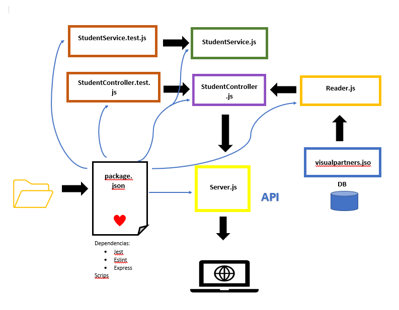
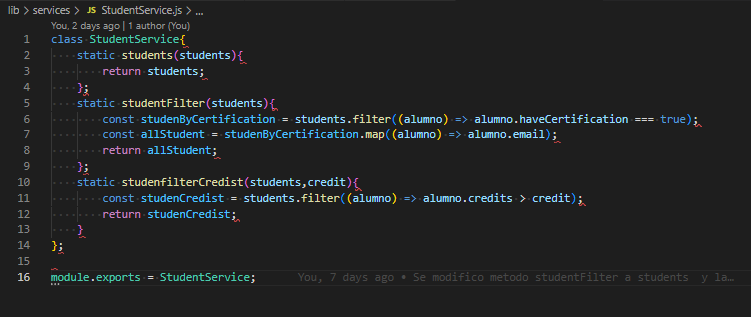
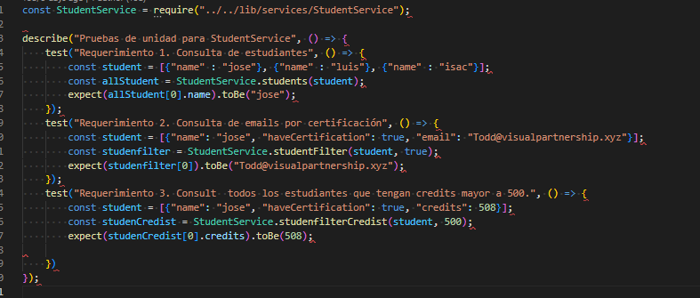

# Code-Challenge

Semana 4 de LaunchX-InnovaccionVirtual Mission NodeJS: Code Challenge

## Dependencias que se usaron.

Para la realización de este proyecto se utilizó varias dependencias esenciales para el funcionamiento de Código.

* `Jest`: Se utilizo para hacer pruebas de unidad, se instaló la vercion  26.0.0 porque la versión más reciente no es compatible con `github actions`
* `express`: Con esta dependencia la utilizamos para poder crear el servidor.
* `eslint`: Para la corrección de inconsistencias del código.

Tambien se utilizó la herramienta `git` para versionar el proyecto y `GitHub Actions` para automatizar las pruebas de unidad cuando se realice un push al repositorio.

## Diseño de componentes.

### Diagrama

### Descripción del programa

El programa es una Api que muestra todos los estudiantes de `visualpartners.json` de una base de datos, también muestra el email de todos los que tienen certificación `haveCertification` y finalmente muestra a todo los alumnos que tengan los créditos mayores a los proporcionados por el usuario.

`StudentService.js` este archivo que está dentro de la carpeta `services` están los métodos que contienen la lógica de la aplicación, a qui se encuentra la clase ` class StudenService`, en ella hay tres métodos.

* En el primer método `students(students)` que nos muestra toda la lista de estudiantes y solo recibe el parámetro `students` que es la base de datos de los alumnos que vienen del archivo `visualpartners.json`.
* El segundo método es `studentFilter(students)` aquí se hace le filtrado de los alumnos que tengan `haveCertification` en   `true` y solo se filtran sus emails.
* Finalmente, el método `studenfilterCredist(students,credit)` muestra a los alumnos que tengan los créditos mayor a los asignados por el usuario y en parámetro `credit` se manda la cantidad de créditos que deben tener los alumnos.

`StudentController.js` este archivo es un puente entre `StudentService.js` y `server.js`.

`Reader.js` Es un archivo de utilidad lee la bases de datos ` visualpartners.json`.

`server.js` contiene los endpoints y las rutas de las Apis que se mostraran en la pagina web consultada por los usuarios.

`StudentService.test.js` Contiene las pruebas de unidad de los metodos de la clase `class StudentServer`

!

## API

### Consultas 

Para hace consultas en la api ingresamos a la dirección `http://localhost:3000/` y nos darala la bienvenida.

 Para ver todos los estudiantes de Visual Partners entramos en `http://localhost:3000/v1/allStudents`.

 

 Paara ver a todos los emails de estudiantes que tienen certificación `http://localhost:3000/v1/studentCertification/email`

 Y por ultimo para ver a los estudiantes con mayor creditos dados entramos con  `http://localhost:3000/v1/studentFilter/:credits` donde `: credits` es donde se asignara el valor a buscar por ejemplo  `http://localhost:3000/v1/studentFilter/500` nostrara a los alunmos moyores a 500.

 
 